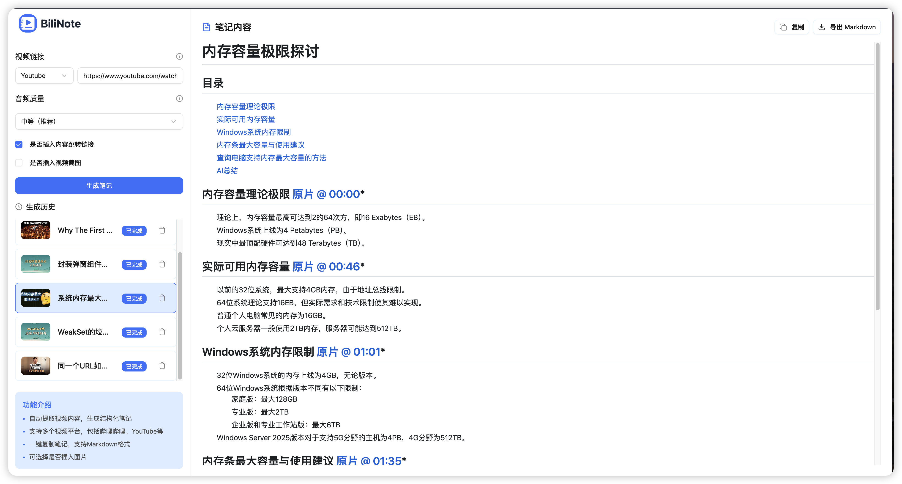

<div style="display: flex; justify-content: center; align-items: center; gap: 10px;
">
    <p align="center">
  
</p>
<h1 align="center" > BiliNote</h1>
</div>

<p align="center"><i>AI 视频笔记生成工具 让 AI 为你的视频做笔记</i></p>

<p align="center">
  
  
  
  
  
  
  
</p>


## ✨ 项目简介

BiliNote 是一个开源的 AI 视频笔记助手，支持通过哔哩哔哩、YouTube 等视频链接，自动提取内容并生成结构清晰、重点明确的 Markdown 格式笔记。支持插入截图、原片跳转等功能。

## 🚀 体验地址
[https://www.bilinote.app](https://www.bilinote.app) 
注意：由于 项目部署在 Cloudflare Pages，访问速度可能存在一些问题，请耐心等待。

## 📦 Windows 打包版
本项目提供了 Windows 系统的 exe 文件，可在[release](https://github.com/JefferyHcool/BiliNote/releases/tag/v1.0.0) 进行下载。


## 🔧 功能特性

- 支持多平台：Bilibili、YouTube（后续会加入更多平台）
- 本地模型音频转写（支持 Fast-Whisper）
- GPT 大模型总结视频内容（支持 OpenAI、DeepSeek、Qwen）
- 自动生成结构化 Markdown 笔记
- 可选插入截图（自动截取）
- 可选内容跳转链接（关联原视频）
- 任务记录与历史回看

## 📸 截图预览




## 🚀 快速开始

### 1. 克隆仓库

```bash
git clone https://github.com/JefferyHcool/BiliNote.git
cd BiliNote
mv .env.example .env
```

### 2. 启动后端（FastAPI）

```bash
cd backend
pip install -r requirements.txt
uvicorn app.main:app --reload
```

### 3. 启动前端（Vite + React）

```bash
cd BiliNote_frontend
pnpm install
pnpm dev
```

访问：`http://localhost:5173`

## ⚙️ 依赖说明
### 🎬 FFmpeg
本项目依赖 ffmpeg 用于音频处理与转码，必须安装：
```bash
# Mac (brew)
brew install ffmpeg

# Ubuntu / Debian
sudo apt install ffmpeg

# Windows
# 请从官网下载安装：https://ffmpeg.org/download.html
```
> ⚠️ 若系统无法识别 ffmpeg，请将其加入系统环境变量 PATH

### 🚀 CUDA 加速（可选）
若你希望更快地执行音频转写任务，可使用具备 NVIDIA GPU 的机器，并启用 fast-whisper + CUDA 加速版本：

具体 `fast-whisper` 配置方法，请参考：[fast-whisper 项目地址](http://github.com/SYSTRAN/faster-whisper#requirements)

### 🐳 使用 Docker 一键部署

确保你已安装 Docker 和 Docker Compose：

#### 1. 克隆本项目
```bash
git clone https://github.com/JefferyHcool/BiliNote.git
cd BiliNote
mv .env.example .env
```
#### 2. 启动 Docker Compose
``` bash
docker compose up --build
```
默认端口：

前端：http://localhost:${FRONTEND_PORT}

后端：http://localhost:${BACKEND_PORT}

.env 文件中可自定义端口与环境配置。


## ⚙️ 环境变量配置

后端 `.env` 示例：

```ini
API_BASE_URL=http://localhost:8000
OUT_DIR=note_results
IMAGE_BASE_URL=/static/screenshots
MODEl_PROVIDER=openai
OPENAI_API_KEY=sk-xxxxxx
DEEP_SEEK_API_KEY=xxx
QWEN_API_KEY=xxx
```

## 🧠 TODO

- [ ] 支持抖音及快手等视频平台
- [ ] 支持前端设置切换 AI 模型切换、语音转文字模型
- [ ] AI 摘要风格自定义（学术风、口语风、重点提取等）
- [ ] 笔记导出为 PDF / Word / Notion
- [ ] 加入更多模型支持
- [ ] 加入更多音频转文本模型支持

### Contact and Join-联系和加入社区
- BiliNote 交流QQ群：785367111
- BiliNote 交流微信群:
  
  

## 📜 License

MIT License

---

💬 你的支持与反馈是我持续优化的动力！欢迎 PR、提 issue、Star ⭐️

